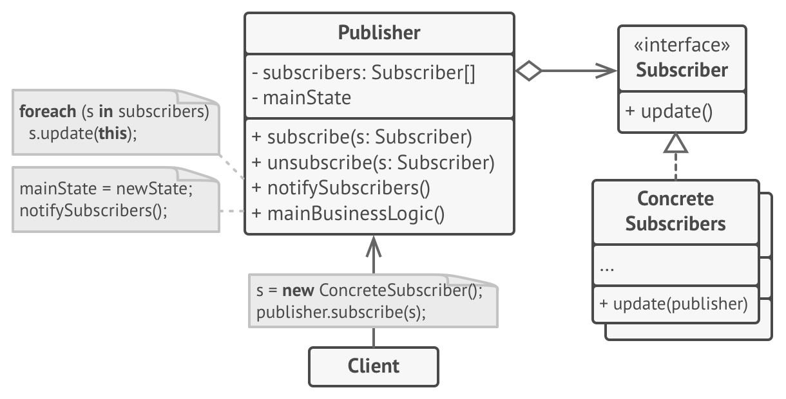

# Observer pattern summary

The diagram below shows one of the two ways to implement the observer pattern. (You can read about it [here](https://refactoring.guru/design-patterns/observer)). Recreate the diagram below (on pen and paper) but replace the classes and methods with the ones that you've defined in the lab!

